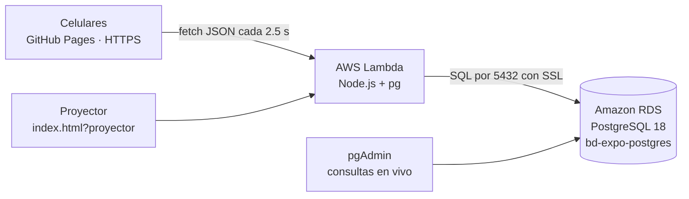

# Globo RDS · Plan técnico

Juego para la exposición de **Amazon RDS con PostgreSQL**: unas 30 personas entran desde el celular con su nombre y un color único, reclaman países en un globo 3D y todo se guarda en nuestra base de RDS. Tiene además un modo de realidad virtual / aumentada.

---

## 0. Versión 2 · Modo carrera, nombres en el mapa, AR y diseño nuevo

### Reglas del juego
| Regla | Cómo funciona | Dónde vive |
|---|---|---|
| Rondas con cronómetro | El administrador inicia una ronda de N minutos desde `/admin/`; el mapa queda en blanco y todos los celulares muestran la cuenta regresiva | `controlar_ronda()` y `fase_ronda()` en `05_rondas.sql` |
| Países ilimitados | `max_paises_por_jugador = 0` | tabla `config` |
| Robos en cadena | Tocar un país de otro jugador te lo quedas al instante, sin protección (`proteccion_segundos = 0`, ajustable en `/admin/`) | `reclamar_pais()` bloquea la fila del país con `FOR UPDATE`, así dos robos simultáneos no chocan |
| Ganador | El que tenga más países al terminar; en empate, quien llegó primero a esa cantidad | vista `ranking` y `ordenarRanking()` en el navegador |
| Hora justa para todos | Cada respuesta trae la hora del servidor (`ahora`) y el celular corrige su reloj | `juego.js` (`desfase`) |
| Reinicio total | `TRUNCATE reclamos, eventos, jugadores RESTART IDENTITY`: vacía las tablas y regresa los `SERIAL` a 1 en un solo paso | `reiniciar_juego()` |
| Modos | `libre` (sin tiempo, para practicar), `espera` (mapa en blanco, nadie puede reclamar), `jugando`, `terminada` (automática al llegar a la hora de fin) | `config.modo` |

### Movilidad en el celular, versión carrera
- **Un toque conquista o roba.** En una carrera, abrir una ficha y luego pulsar un botón es demasiado lento. Girar el globo nunca conquista nada, porque el toque solo cuenta si el dedo se movió menos de 10 px.
- Tocar un país tuyo abre su ficha, con la opción de liberarlo.
- **Nombres sobre el mapa:** cada país conquistado muestra el nombre de su dueño. Las etiquetas que quedan detrás del globo o que se enciman se ocultan; tienen prioridad las tuyas y los países grandes, y al acercar el globo aparecen más.
- **Cintillo tipo noticiero** con lo que pasa («Ana le quitó Brasil a Luis»). Si te roban, el celular vibra.
- Durante la ronda, el celular pregunta cada 1.5 s en lugar de cada 2.5 s.
- **Marcador fijo abajo:** tu lugar, los primeros 3 y barras de progreso. Se abre para ver a todos.

### Realidad aumentada (Android)
| Antes | Ahora |
|---|---|
| El globo aparecía fijo frente a la cara | **Se coloca sobre una mesa o el piso**: el celular detecta superficies (WebXR *hit-test*), aparece un círculo y lo tocas. Si no encuentra superficie en 8 s, lo pone frente a ti |
| Solo se giraba con botones ⟲ ⟳ | **Arrastrar con un dedo** gira e inclina; **pellizcar con dos dedos** cambia el tamaño |
| Sin nombres | **Nombres de los dueños** flotando sobre cada país |
| Para reclamar había que tocar el país y luego un botón | Un toque conquista o roba, igual que en el celular |
| — | Botón **Recolocar**, cronómetro visible arriba y avisos dentro de la AR |

### Diseño: por qué se ve así
La versión anterior tenía los rasgos típicos de una interfaz generada por IA: fondo azul marino, efecto de vidrio esmerilado, botones de píldora y letras tipo máquina de escribir en naranja. La nueva dirección es **«noche electoral»**, inspirada en los mapas de cobertura de elecciones en televisión:
- **Mapa político en blanco y gris**: el color **solo** lo ponen los jugadores. Por eso se quitaron de la paleta 7 colores pálidos que se confundían con la tierra libre.
- **Tipografía de marcador**: *Big Shoulders Display*, condensada y en mayúsculas, para números, cronómetro y nombres; *Instrument Sans* para el texto.
- **Un solo color de acento**: rojo «en vivo», reservado para el cronómetro y el indicador de conexión.
- **Esquinas rectas, líneas de 1–2 px, sombras sólidas** tipo impresión. Nada de vidrio ni degradados.
- **Fondo de «mesa de mapas»** con retícula de puntos, y meridianos y paralelos en el globo.
- El proyector se ve como una pantalla de televisión: cronómetro gigante, marcador con barras y QR.

### Administración separada
El panel ahora vive en **`/admin/`**, una dirección aparte con inicio de sesión. La contraseña se valida contra `ADMIN_KEY` en la Lambda. La página del juego no tiene ningún enlace hacia él.

---

## 1. La restricción que decide la arquitectura

**GitHub Pages solo publica archivos estáticos** (HTML, CSS, JS). No ejecuta código de servidor. Y un navegador **no puede conectarse directo a PostgreSQL**:

- PostgreSQL habla su propio protocolo por TCP (puerto 5432), no HTTP; los navegadores solo hablan HTTP/WebSocket.
- Aunque se pudiera, la contraseña de la base quedaría a la vista de cualquiera que abra la página.

Por eso se necesita **una pieza en medio** que reciba peticiones HTTPS y hable con RDS. Elegimos **AWS Lambda** con una *URL de función*.



| Opción considerada | Por qué sí / por qué no |
|---|---|
| **AWS Lambda + URL de función** (elegida) | Sin servidor que administrar, URL HTTPS fija, capa gratuita permanente (1 millón de solicitudes al mes), sigue funcionando aunque apagues tu laptop. Además refuerza el tema de la exposición: «servicio administrado». |
| Servidor Node en la laptop + túnel HTTPS | Funciona y lo incluimos como **plan B** (`npm run local`), pero depende de que la laptop esté prendida y la URL del túnel cambia cada vez. |
| EC2 con servidor web | Contradice el mensaje de la exposición: habría que administrar un sistema operativo. |
| API Gateway + Lambda | Más pasos de configuración para el mismo resultado. |
| Supabase / Firebase | No usarían nuestra base de RDS, que es el punto de la exposición. |

---

## 2. Tecnologías

| Capa | Tecnología | Para qué |
|---|---|---|
| Globo 3D del celular | **globe.gl** (sobre three.js / WebGL) | Globo con países en relieve, giro con un dedo, pellizco para zoom, detección de toque sobre países. |
| Modo VR / AR | **three.js + three-globe + WebXR** | Mismo globo dentro de una escena inmersiva. WebXR es el estándar del navegador para visores y AR. |
| Mapa | **Natural Earth 1:110m** (177 países) | Dominio público. Se aligeró de 488 KB a 178 KB y se tradujo al español con `herramientas/preparar-datos.mjs`. |
| Interfaz | HTML + CSS + JavaScript con módulos ES, **sin build** | Se sube tal cual a GitHub Pages; cualquiera del equipo puede leer y editar el código. |
| QR del proyector | qrcode-generator | Genera el QR que escanean los compañeros. |
| API | **Node.js 22 en AWS Lambda** + librería **pg** | Valida datos y llama a las funciones de PostgreSQL. |
| Base de datos | **Amazon RDS for PostgreSQL 18** (la que ya tenemos) | Tablas, llaves, restricciones y funciones PL/pgSQL. |
| Hosting | **GitHub Pages** (carpeta `docs/`) | HTTPS gratis; WebXR exige HTTPS. |

Las librerías del navegador se cargan desde CDN (jsDelivr y esm.sh), así que no hay `node_modules` en la página.

---

## 3. Modelo de datos

```mermaid
erDiagram
  colores   ||--o| jugadores : "un color = un jugador"
  jugadores ||--o{ reclamos  : reclama
  paises    ||--o| reclamos  : "un país = un dueño"
  jugadores ||--o{ eventos   : genera
  paises { char iso PK  varchar nombre  varchar continente  numeric lat  numeric lng }
  colores { char hex PK  varchar nombre  smallint orden }
  jugadores { serial id PK  varchar nombre UK  char color FK_UK  uuid token UK  timestamptz creado_en }
  reclamos { char iso PK_FK  int jugador_id FK  timestamptz reclamado_en }
  eventos { bigserial id PK  varchar tipo  int jugador_id  char iso  timestamptz creado_en }
  config { varchar clave PK  varchar valor }
```

**Las reglas del juego las garantiza PostgreSQL, no el celular:**

| Regla | Cómo la hace cumplir la base |
|---|---|
| Colores sin repetir | Índice único `jugadores_color_uq` + llave foránea a `colores` (solo colores de la paleta). |
| Nombres sin repetir | Índice único sobre `lower(nombre)` (Ana = ANA). |
| Un país, un dueño | `reclamos.iso` es **llave primaria**. |
| Dos personas reclaman el mismo país al mismo tiempo | `INSERT … ON CONFLICT DO NOTHING`: gana la primera, la otra recibe «ocupado». |
| Máximo de países por persona | `reclamar_pais()` bloquea la fila del jugador (`FOR UPDATE`) y cuenta antes de insertar, así ni con dos toques simultáneos se pasa del límite. |
| Nadie puede reclamar por otro | Cada celular guarda un **token UUID secreto**; sin él no se puede reclamar. |
| La app no puede hacer cualquier cosa | El usuario `globo_app` **no tiene permisos sobre tablas**: solo puede ejecutar 9 funciones (`SECURITY DEFINER`). Mínimo privilegio. |

Esto es material directo para la exposición: restricciones, llaves, transacciones, bloqueos y roles de PostgreSQL funcionando con 30 personas a la vez.

---

## 4. API (Lambda)

| Método y ruta | Cuerpo | Responde |
|---|---|---|
| `GET /salud` | — | `{ok, hora, version}` para probar que todo conecta |
| `GET /estado?v=N` | — | `{sinCambios:true}` si nada cambió desde la versión N; si cambió, todo el estado |
| `GET /colores` | — | Paleta con `libre: true/false` |
| `POST /jugadores` | `{nombre, color}` | `{id, nombre, color, token}` o `nombre_ocupado` / `color_ocupado` |
| `POST /yo` | `{token}` | Confirma que el celular sigue registrado |
| `POST /reclamar` | `{token, iso}` | `ok` · `ocupado` (con dueño) · `limite` · `juego_cerrado` |
| `POST /liberar` | `{token, iso}` | `ok` · `no_es_tuyo` |
| `POST /admin` | `{clave, accion, max?, abierto?}` | Reiniciar o cambiar reglas (protegido con `ADMIN_KEY`) |

Todas las peticiones son «simples» para el navegador (GET, o POST con `Content-Type: text/plain`): así **no hay petición previa de CORS** (*preflight*), que es una fuente común de errores.

### Tiempo real con *polling*
Cada celular pregunta cada 2.5 s: «¿cambió algo desde la versión N?». La versión es el id del último evento. Si no cambió, la respuesta pesa unos cuantos bytes.

- 30 celulares × 1 petición cada 2.5 s ≈ **12 peticiones por segundo ≈ 43,000 por hora**. La capa gratuita de Lambda cubre 1,000,000 al mes.
- En la base: cada consulta de versión es instantánea (máximo de una llave primaria).
- Se descartaron los WebSockets porque requieren API Gateway y más configuración; para un juego por turnos, 2.5 s es suficiente.

---

## 5. Movilidad: obstáculos previstos y cómo se resolvieron

| Obstáculo en el celular | Qué pasaría | Solución implementada |
|---|---|---|
| Girar el globo vs. tocar un país | Al girar con el dedo se reclamarían países por accidente | Un toque solo cuenta si el dedo se movió menos de 10 px. Además, tocar **solo selecciona**: para reclamar hay que pulsar el botón grande de la hoja inferior. |
| «Jalar para recargar» y scroll de la página | La página se mueve o recarga mientras giras | `overscroll-behavior: none`, `touch-action: none` en el globo, cuerpo sin scroll. |
| Zoom del navegador | Doble toque o pellizco hacen zoom a la página en vez de al globo | El globo captura los gestos; los campos de texto usan 16 px (iPhone hace zoom con menos). |
| Barra del navegador que aparece/desaparece | El globo queda cortado o descentrado | `ResizeObserver` ajusta el tamaño del globo en cada cambio; unidades `dvh`; respeta el notch con `safe-area-inset`. |
| Celulares de gama baja | Lentitud, calentamiento, batería | Mapa ligero (178 KB, 177 países), sin texturas de foto, resolución limitada a 2× y transiciones cortas. |
| Pantalla apagada u otra app | Seguiría gastando datos y batería | Se pausa el *polling* cuando la página no está visible y se reanuda al volver. |
| Países diminutos (Luxemburgo, Catar, islas) | Imposibles de tocar | Botón **Buscar**: escribes el nombre (sin importar acentos), el globo vuela hasta él y lo selecciona. |
| Wi-Fi de la escuela inestable | Errores al reclamar | El reclamo se pinta al instante (*optimista*) y se deshace si falla; reintentos automáticos con espera creciente (2.5 s → 20 s); indicador de conexión arriba. |
| Primera petición lenta (*cold start* de Lambda) | 1–2 s de espera la primera vez | Tiempo de espera de 9 s en el celular y mensaje «Conectando…». |
| Dos personas eligen el mismo color a la vez | Colores repetidos | La base lo impide; al perdedor se le dice «Alguien acaba de elegir ese color» y la paleta se recarga. La paleta se actualiza cada 4 s mientras te registras. |
| Recargar la página o cerrar el navegador | Perder el jugador | El token se guarda en el celular (`localStorage`) y al volver se valida con `/yo`. |
| Modo incógnito estricto | `localStorage` bloqueado | Se guarda en memoria mientras la pestaña siga abierta. |
| Cambiar de celular | El jugador queda en el celular anterior | Limitación aceptada (sin contraseñas, para que entrar sea rápido). |
| Reiniciar el juego antes de exponer | Celulares con jugadores que ya no existen | El celular detecta que ya no aparece, lo confirma con `/yo` y vuelve a la pantalla de registro. |
| Nombres con código malicioso (`<script>`) | Ataque XSS en otros celulares | Todo texto de usuario se escapa antes de mostrarse; la API solo acepta letras, números, espacio, punto, guion y guion bajo. |
| 36 colores parecidos entre sí | Confusión en el mapa | Paleta curada para contrastar con el océano oscuro; el nombre del dueño siempre se muestra junto al color. |

---

## 6. Plan de realidad virtual / aumentada

**Sí se puede diseñar VR con código**: WebXR es una API del navegador, y three.js la integra. La página `vr.html` reutiliza el mismo estado del juego (`juego.js`), así que lo que reclames en VR aparece en todos los celulares.

| Dispositivo | Qué verán | Cómo se interactúa |
|---|---|---|
| **Meta Quest** (navegador del visor) | VR inmersiva: el globo flota frente a ti, en el espacio, con un letrero del país elegido | Apuntar con el control y gatillo = elegir; gatillo otra vez = reclamar/liberar; botón de agarre + mover el brazo, o palanca = girar el globo; vibración al reclamar |
| **Android** con Chrome y ARCore | **Realidad aumentada**: el globo aparece flotando en tu cuarto; puedes caminar a su alrededor | Tocar la pantalla sobre un país = elegir; botón «Reclamar»; botones ⟲ ⟳ para girarlo |
| **iPhone** (Safari) | Vista 3D normal (Apple no soporta WebXR en iPhone) | Igual que la página principal |
| Computadora | Vista 3D con mouse | Arrastrar y hacer clic |

**Decisiones de diseño para VR:**
- **Registrarse primero en la página normal**: dentro del visor no hay teclado cómodo. VR y la página comparten el mismo sitio, así que el token se reutiliza.
- **Confirmación con doble selección** en VR (no hay botones de pantalla) para evitar reclamos accidentales.
- **Sin movimientos de cámara forzados** (evita mareo): el globo gira, tú no.
- **Sin animaciones de transición dentro de XR**: en una sesión inmersiva el navegador pausa el `requestAnimationFrame` normal, que usan esas animaciones.
- **Globo de 30 cm de radio en VR y de 18 cm en AR**, para que quepa sobre una mesa.

**Limitaciones y pruebas pendientes** (no se pudieron probar sin los dispositivos):
1. Probar `vr.html` en un Meta Quest y en un Android con ARCore (en *Configuración › Apps › Google Play Services for AR*).
2. Si las librerías de esm.sh fallan, el plan B es la página principal, que no depende de ellas.
3. WebXR solo funciona en HTTPS: en GitHub Pages sí; con el servidor local por IP (`http://`) no.

---

## 7. Seguridad

- La contraseña de la base **solo** existe en las variables de entorno de Lambda y en `api/.env` (que `.gitignore` excluye). **Nunca** en GitHub.
- Usuario `globo_app` con privilegios mínimos (solo ejecutar funciones).
- Conexión cifrada a RDS con verificación del certificado de Amazon (`global-bundle.pem`).
- `ALLOWED_ORIGIN` limita qué sitio puede usar la API desde un navegador.
- La regla `0.0.0.0/0` del security group es necesaria porque Lambda (fuera de la VPC) cambia de IP. Es aceptable **solo para la práctica**; en producción la Lambda iría dentro de la VPC y el security group solo aceptaría al de la Lambda.
- Las funciones de administración requieren `ADMIN_KEY`.

---

## 8. Costos (plan gratuito de AWS)

| Recurso | Uso estimado en 1 hora de juego | Costo |
|---|---|---|
| Lambda | ~43,000 invocaciones · 256 MB · ~50 ms | Dentro de la capa gratuita permanente |
| RDS db.t4g.micro | 1 hora encendida | ~0.02 USD de créditos |
| Transferencia de datos | Unos MB | Despreciable |
| GitHub Pages | — | Gratis |

Al terminar: detener o borrar la base. La Lambda sin uso no cuesta nada.

---

## 9. Plan B del día de la exposición

Si Lambda falla o la red de la escuela bloquea algo:
1. En la laptop: `cd api` y `npm run local`.
2. Conecta la laptop y los celulares a la **misma red** (por ejemplo, el hotspot de un celular).
3. Los compañeros abren `http://IP-DE-LA-LAPTOP:8787`; la terminal muestra la IP.
4. Windows preguntará si permites el acceso a la red: elige **Redes privadas › Permitir**.

---

## 10. Estado de lo construido

| Pieza | Estado |
|---|---|
| SQL (esquema, 177 países, usuario de la app, consultas demo, reinicio) | Escrito; falta ejecutarlo en pgAdmin |
| API Lambda | Escrita; validaciones probadas sin base; empaquetado `function.zip` probado |
| Globo del celular + registro + ranking + búsqueda + proyector con QR | Escrito; probar en celulares reales |
| Modo VR/AR | Escrito; **sin probar en visor o Android AR** |
| Página de administración | Escrita |
